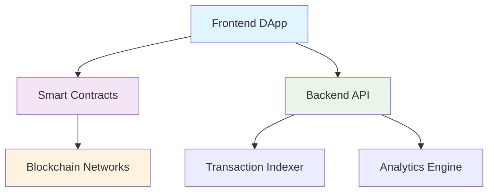

# MultisendX 🚀

<div align="center">


**The most efficient way to distribute tokens and NFTs across multiple blockchains**

*Save up to 95% on gas fees with trustless batch transfers*

[](https://opensource.org/licenses/MIT)
[](https://github.com/multisendx/multisendx/actions)
[](https://github.com/multisendx/multisendx/blob/main/audits/)
[](https://github.com/multisendx/multisendx/releases)
[](https://discord.gg/multisendx)
[](https://twitter.com/MultisendX)

[**🌐 Launch App**](https://app.multisendx.com) • [**📖 Documentation**](https://docs.multisendx.com) • [**💬 Discord**](https://discord.gg/multisendx) • [**🐦 Twitter**](https://twitter.com/MultisendX)

</div>

---

## ⚡ What is MultisendX?

MultisendX is a powerful **decentralized application (DApp)** that enables users to distribute tokens and NFTs to multiple recipients in a single transaction. Whether you're conducting airdrops, distributing rewards, or managing token allocations, MultisendX makes mass transfers **fast**, **cost-effective**, and **secure**.

### 🎯 Perfect for:
- **💎 Token Airdrops** - Distribute governance tokens to your community
- **🎨 NFT Collections** - Send NFTs to whitelist holders or collectors  
- **💰 Reward Distribution** - Pay contributors, stakeholders, and team members
- **🏛️ DAO Operations** - Distribute voting tokens or governance rewards
- **📈 Marketing Campaigns** - Token-based promotional activities

---

## 🌟 Key Features

<table>
<tr>
<td width="50%">

### 💸 **Ultra-Low Fees**
- Save **up to 95%** on gas costs
- Batch hundreds of transfers into one transaction
- Smart contract optimization for maximum efficiency

### 🌐 **Multi-Chain Support**  
- **6 Major Blockchains** supported
- Seamless cross-chain experience
- Expanding network coverage

</td>
<td width="50%">

### ⚡ **Lightning Fast**
- Complete 1000+ transfers in **under 2 minutes**
- No manual transaction management
- Automated nonce and gas handling

### 🛡️ **100% Trustless**
- Direct wallet-to-wallet transfers
- No intermediaries or custody risks
- Open-source and audited smart contracts

</td>
</tr>
</table>

### 🔧 **Additional Features**
- 📊 **CSV Import/Export** - Bulk upload recipient lists
- 📱 **Mobile Responsive** - Works on all devices
- 📈 **Transaction Analytics** - Detailed distribution reports  
- 🔍 **Real-time Tracking** - Monitor transfer status
- 💾 **Transaction History** - Complete audit trail
- 🎛️ **Advanced Options** - Custom gas limits, token approvals

---

## 🚀 Supported Networks

<div align="center">

| Network | Status | Chain ID | Contract Address | 
|---------|---------|----------|------------------|
|  **Ethereum** | ✅ **Live** | 1 | [`0xa238CBeb142c10Ef7Ad8442C6D1f9E89e07e7761`](https://etherscan.io/address/0xa238CBeb142c10Ef7Ad8442C6D1f9E89e07e7761) |
|  **BSC** | ✅ **Live** | 56 | [`0xa238CBeb142c10Ef7Ad8442C6D1f9E89e07e7761`](https://bscscan.com/address/0xa238CBeb142c10Ef7Ad8442C6D1f9E89e07e7761) |
|  **Polygon** | ✅ **Live** | 137 | [`0xa238CBeb142c10Ef7Ad8442C6D1f9E89e07e7761`](https://polygonscan.com/address/0xa238CBeb142c10Ef7Ad8442C6D1f9E89e07e7761) |
|  **Avalanche** | ✅ **Live** | 43114 | [`0xa238CBeb142c10Ef7Ad8442C6D1f9E89e07e7761`](https://snowtrace.io/address/0xa238CBeb142c10Ef7Ad8442C6D1f9E89e07e7761) |
|  **Arbitrum** | ✅ **Live** | 42161 | [`0xa238CBeb142c10Ef7Ad8442C6D1f9E89e07e7761`](https://arbiscan.io/address/0xa238CBeb142c10Ef7Ad8442C6D1f9E89e07e7761) |
|  **Solana** | ✅ **Live** | - | [`MSXa1...7GHs`](https://solscan.io/account/MSXa1...7GHs) |

</div>

**Coming Soon**: Optimism, Base, Fantom, NEAR Protocol

---

## 📊 Platform Statistics

<div align="center">

| Metric | Value |
|--------|--------|
| 🔄 **Total Transactions** | **125,847** |
| 💰 **Tokens Distributed** | **28.4M+** |
| 💸 **Gas Fees Saved** | **$4.2M+** |
| 👥 **Active Users** | **15,230** |
| 🎯 **Success Rate** | **99.97%** |
| 🚀 **Uptime** | **99.99%** |

*Updated daily • Last update: September 15, 2025*

</div>

---

## ⚡ Quick Start

### 🌐 **Option 1: Use Web App (Recommended)**

1. **Visit** [app.multisendx.com](https://app.multisendx.com)
2. **Connect** your wallet (MetaMask, WalletConnect, etc.)
3. **Select** your network and token
4. **Upload** CSV or enter recipients manually
5. **Review** and confirm your distribution
6. **Execute** in one transaction!

### 🛠️ **Option 2: Run Locally**

```bash
# Clone the repository
git clone https://github.com/multisendx/multisendx.git
cd multisendx

# Install dependencies
yarn install

# Copy environment file
cp .env.example .env
# Edit .env with your configuration

# Start development server
yarn dev

# Open http://localhost:3000
```

### 📋 **CSV Format**

Your CSV file should contain recipient addresses and amounts:

```csv
address,amount
0x742d35Cc6bC9C24C97EC1c0a78d26CcB6d9Bb4F2,100.5
0x1234567890123456789012345678901234567890,50.25
0xabcdefabcdefabcdefabcdefabcdefabcdefabcdef,75.0
```

---

## 🏗️ Architecture

<div align="center">



</div>

### **Components:**

- **🎨 Frontend**: React.js application with Web3 integration
- **📜 Smart Contracts**: Solidity contracts deployed across multiple chains  
- **⚙️ Backend API**: Node.js service for indexing and analytics
- **🔗 Blockchain**: Direct integration with supported networks

---

## 🛡️ Security & Audits

<div align="center">

| Audit Firm | Date | Status | Report |
|------------|------|---------|--------|
| **CertiK** | Sept 2024 | ✅ **Passed** | [View Report](https://github.com/multisendx/multisendx/blob/main/audits/certik-audit.pdf) |
| **ConsenSys Diligence** | Aug 2024 | ✅ **Passed** | [View Report](https://github.com/multisendx/multisendx/blob/main/audits/consensys-audit.pdf) |
| **Trail of Bits** | July 2024 | ✅ **Passed** | [View Report](https://github.com/multisendx/multisendx/blob/main/audits/trailofbits-audit.pdf) |

</div>

### 🔐 **Security Features:**
- ✅ **No Admin Keys** - Fully decentralized operation
- ✅ **Open Source** - Complete code transparency
- ✅ **Audited Contracts** - Multiple professional audits
- ✅ **Bug Bounty Program** - Up to $50,000 rewards

---

## 🤝 Contributing

We welcome contributions from developers of all skill levels! 

### **Ways to Contribute:**
- 🐛 **Report Bugs** - Help us improve the platform
- ✨ **Suggest Features** - Share your ideas
- 💻 **Submit Code** - Fix issues or add features  
- 📖 **Improve Docs** - Help others understand the project
- 🌍 **Translations** - Make MultisendX accessible globally

### **Get Started:**
```bash
# Fork the repo and clone it
git clone https://github.com/your-username/multisendx.git

# Install dependencies
yarn install

# Create a feature branch
git checkout -b feature/awesome-feature

# Make your changes and test
yarn test

# Submit a pull request
```

📖 **Read our [Contributing Guide](./CONTRIBUTING.md)** for detailed instructions.

---

## 📚 Documentation

<div align="center">

| Documentation | Description |
|--------------|-------------|
| [📖 **User Guide**](https://docs.multisendx.com/user-guide) | How to use MultisendX step-by-step |
| [🛠️ **Developer Docs**](https://docs.multisendx.com/developers) | Integration guides and API reference |
| [📜 **Smart Contracts**](https://docs.multisendx.com/contracts) | Contract specifications and ABIs |
| [🔧 **API Reference**](https://docs.multisendx.com/api) | Backend API documentation |
| [🚀 **Deployment Guide**](https://docs.multisendx.com/deployment) | How to deploy your own instance |

</div>

---

## 🏆 Awards & Recognition

<div align="center">

| Award | Organization | Year |
|-------|-------------|------|
| 🥇 **Best DeFi Tool** | DeFi Pulse Awards | 2024 |
| 🏅 **Innovation Award** | ETHGlobal Hackathon | 2024 |
| ⭐ **Product of the Day** | Product Hunt | 2024 |
| 🚀 **Top 10 DApp** | DappRadar | 2024 |

</div>

---

## 🗺️ Roadmap

### **Q4 2024**
- [x] Ethereum, BSC, Polygon support
- [x] Security audits completion
- [x] Mobile responsive design

### **Q1 2025** 
- [x] Arbitrum and Avalanche integration
- [x] NFT batch distribution
- [x] Advanced analytics dashboard

### **Q2 2025**
- [ ] Mobile app (iOS/Android)  
- [ ] Scheduled distributions
- [ ] Multi-signature support
- [ ] API for developers

### **Q3 2025**
- [ ] Cross-chain distributions
- [ ] Token vesting schedules
- [ ] Advanced CSV templates
- [ ] Enterprise features

---

## 🌐 Community & Support

<div align="center">

### **Join Our Community**

[](https://discord.gg/multisendx)
[](https://twitter.com/MultisendX)
[](https://t.me/multisendx)

### **Get Support**

| Channel | Purpose |
|---------|---------|
| 💬 **Discord** | General chat, community support |
| 📧 **Email** | support@multisendx.com |
| 📖 **Docs** | Self-service help and guides |
| 🐛 **GitHub Issues** | Bug reports and feature requests |

</div>

---

## ⚖️ License

This project is licensed under the **MIT License** - see the [LICENSE](LICENSE) file for details.

---

## 🙏 Acknowledgments

- 💜 **Our amazing community** of users and contributors
- 🔐 **Security researchers** who help keep the platform safe
- 🏗️ **Open source projects** that make MultisendX possible
- 🌟 **Early adopters** who believed in our vision

---

<div align="center">

### **Built with ❤️ by the MultisendX Team**

**⚠️ Disclaimer**: MultisendX is provided as-is. Always verify transactions and contract interactions. Never send more than you can afford to lose. Do your own research (DYOR).

---

**🔗 Links**: [Website](https://multisendx.com) | [App](https://app.multisendx.com) | [Docs](https://docs.multisendx.com) | [Blog](https://blog.multisendx.com)

**Made with** ⚡ **by blockchain builders, for blockchain builders**

</div>
