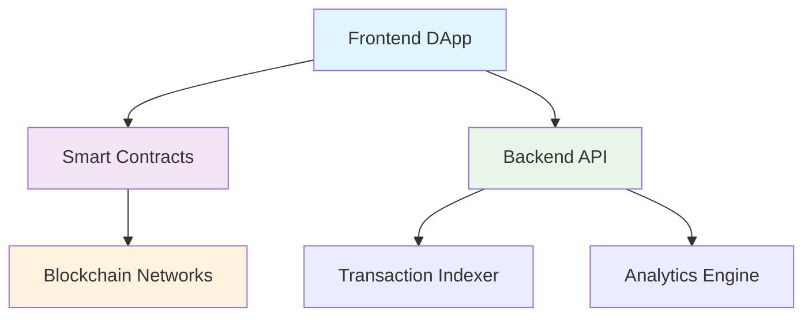

# MultisendX 🚀

<div align="center">

)

**The most efficient way to distribute tokens and NFTs across multiple blockchains**

*Save up to 95% on gas fees with trustless batch transfers*

## ⚡ What is MultisendX?

MultisendX is a powerful **decentralized application (DApp)** that enables users to distribute tokens and NFTs to multiple recipients in a single transaction. Whether you're conducting airdrops, distributing rewards, or managing token allocations, MultisendX makes mass transfers **fast**, **cost-effective**, and **secure**.

### 🎯 Perfect for:
- **💎 Token Airdrops** - Distribute governance tokens to your community
- **💰 Reward Distribution** - Pay contributors, stakeholders, and team members
- **🏛️ DAO Operations** - Distribute voting tokens or governance rewards
- **📈 Marketing Campaigns** - Token-based promotional activities

---

## 🌟 Key Features

<table>
<tr>
<td width="50%">

### 💸 **Ultra-Low Fees**
- Save **up to 95%** on gas costs
- Batch hundreds of transfers into one transaction
- Smart contract optimization for maximum efficiency

### 🌐 **Multi-Chain Support**  
- **6 Major Blockchains** supported
- Seamless cross-chain experience
- Expanding network coverage

</td>
<td width="50%">

### ⚡ **Lightning Fast**
- Complete 1000+ transfers in **under 2 minutes**
- No manual transaction management
- Automated nonce and gas handling

### 🛡️ **100% Trustless**
- Direct wallet-to-wallet transfers
- No intermediaries or custody risks
- Open-source and audited smart contracts

</td>
</tr>
</table>

### 🔧 **Additional Features**
- 📊 **CSV Import/Export** - Bulk upload recipient lists
- 📱 **Mobile Responsive** - Works on all devices
- 📈 **Transaction Analytics** - Detailed distribution reports  
- 🔍 **Real-time Tracking** - Monitor transfer status
- 💾 **Transaction History** - Complete audit trail
- 🎛️ **Advanced Options** - Custom gas limits, token approvals

---

## 🚀 Supported Networks


**Supported Blockchain**: Ethereum, BNB Chain, Base, Arbitrum, Optimism, Unichain


## ⚡ Quick Start

### 🌐 **Option 1: Use Web App (Recommended)**

1. **Visit** [multisendx.com](https://multisendx.com)
2. **Connect** your wallet (MetaMask, WalletConnect, etc.)
3. **Select** your network and token
4. **Upload** CSV or enter recipients manually
5. **Review** and confirm your distribution
6. **Execute** in one transaction!


### 📋 **CSV Format**

Your CSV file should contain recipient addresses and amounts:

```csv
address,amount
0x742d35Cc6bC9C24C97EC1c0a78d26CcB6d9Bb4F2,100.5
0x1234567890123456789012345678901234567890,50.25
0xabcdefabcdefabcdefabcdefabcdefabcdefabcdef,75.0
```

---

## 🏗️ Architecture

<div align="center">



</div>

### **Components:**

- **🎨 Frontend**: React.js application with Web3 integration
- **📜 Smart Contracts**: Solidity contracts deployed across multiple chains  
- **⚙️ Backend API**: Node.js service for indexing and analytics
- **🔗 Blockchain**: Direct integration with supported networks

---


### 🔐 **Security Features:**
- ✅ **No Admin Keys** - Fully decentralized operation
- ✅ **Open Source** - Complete code transparency
- ✅ **Audited Contracts** - Multiple professional audits

---

## 🤝 Contributing

We welcome contributions from developers of all skill levels! 

### **Ways to Contribute:**
- 🐛 **Report Bugs** - Help us improve the platform
- ✨ **Suggest Features** - Share your ideas
- 💻 **Submit Code** - Fix issues or add features  
- 📖 **Improve Docs** - Help others understand the project
- 🌍 **Translations** - Make MultisendX accessible globally


## 🌐 Community & Support

<div align="center">

### **Join Our Community**

[](https://twitter.com/MultisendX)
[](https://t.me/multisendx)

### **Get Support**

| Channel | Purpose |
|---------|---------|
| 💬 **Discord** | General chat, community support |
| 📧 **Email** | support@multisendx.com |
| 📖 **Docs** | Self-service help and guides |
| 🐛 **GitHub Issues** | Bug reports and feature requests |

</div>

---

## ⚖️ License

This project is licensed under the **MIT License** - see the [LICENSE](LICENSE) file for details.

---

## 🙏 Acknowledgments

- 💜 **Our amazing community** of users and contributors
- 🔐 **Security researchers** who help keep the platform safe
- 🏗️ **Open source projects** that make MultisendX possible
- 🌟 **Early adopters** who believed in our vision

---

<div align="center">

### **Built with ❤️ by the MultisendX Team**

**Disclaimer**: MultisendX is provided as-is. Always verify transactions and contract interactions. Never send more than you can afford to lose. Do your own research (DYOR).

---

**🔗 Links**: [Website](https://multisendx.com) | [Twitter](https:x.com/multisendx) | [Telegram](https://t.me/multisendx)

**Made with** ⚡ **by blockchain builders, for blockchain builders**

</div>
